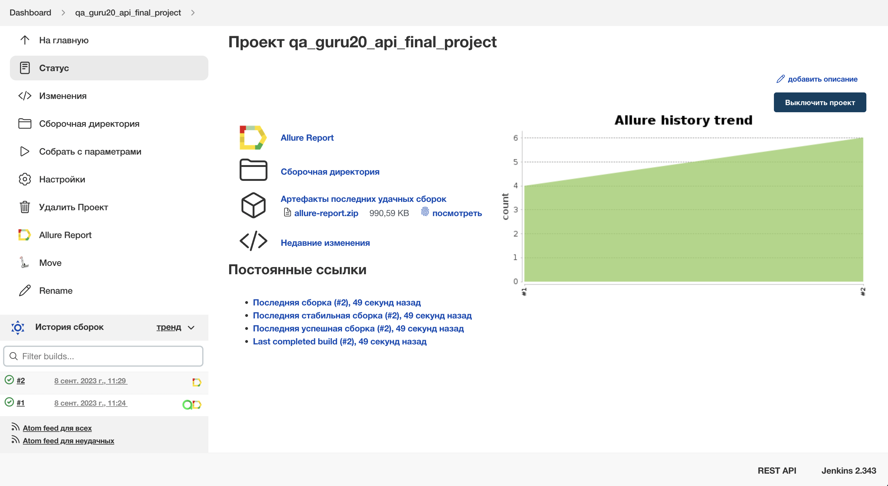
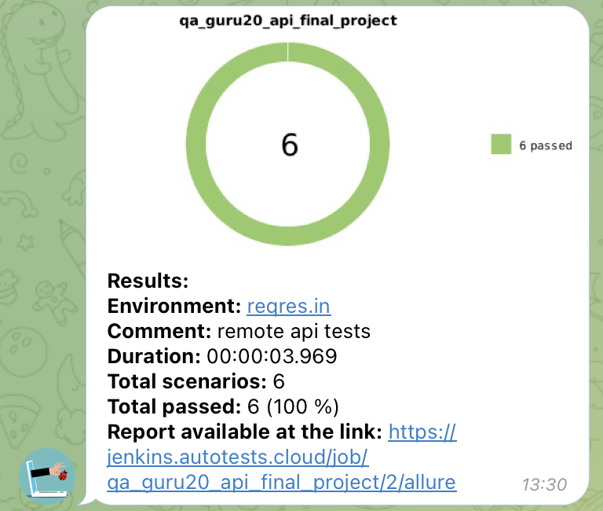
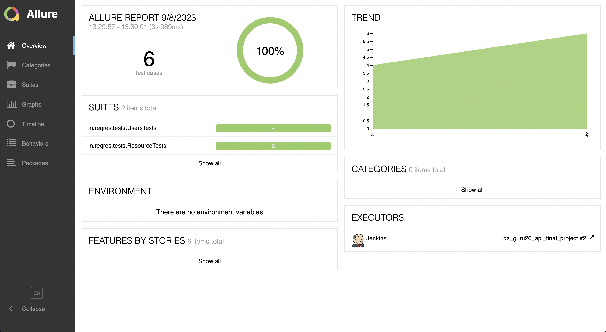
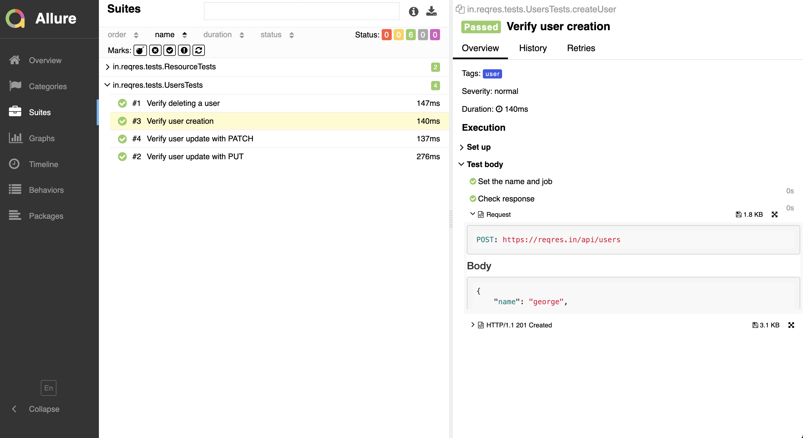
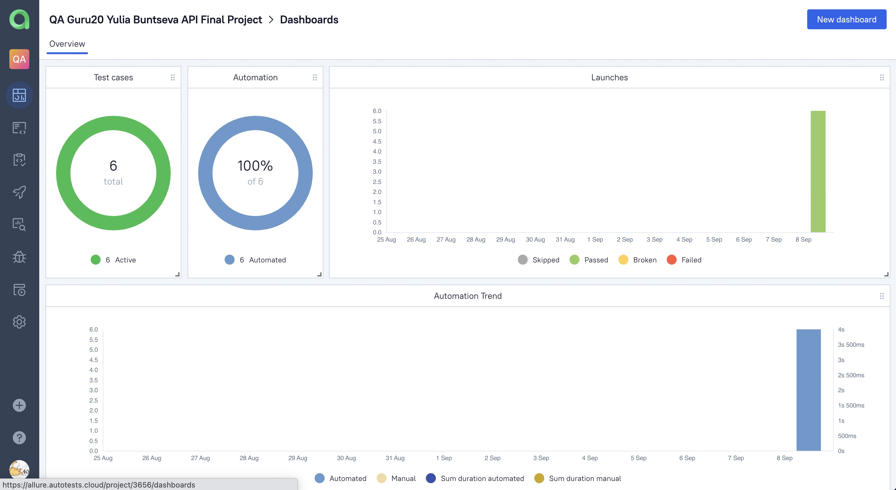
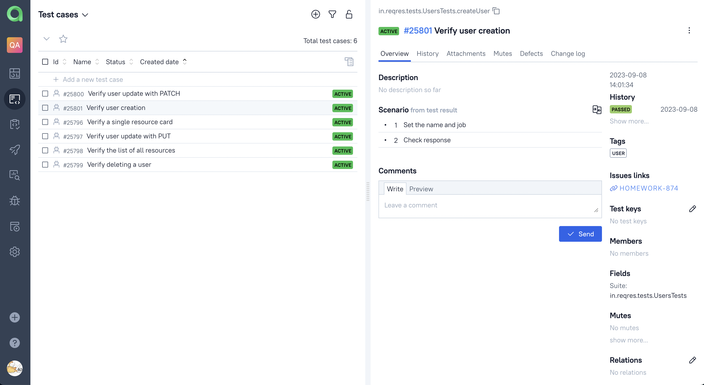
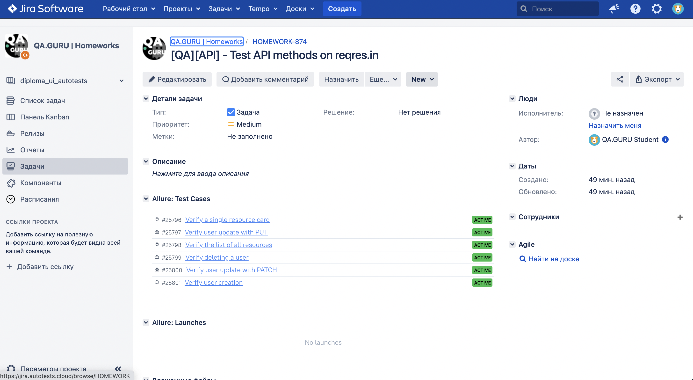

<h1 >API Automation Project for <a href="https://reqres.in/">reqres.in</a></h1>


### :pushpin: Table of contents:

+ [Stack of technologies](#tools)
+ [Running tests](#test-runs)
    + [Running tests from the Terminal](#gradle-commands)
    + [Running tests in Jenkins](#-testrun-in-jenkins)
+ [Telegram notifications](#-telegram-notifications)
+ [Test run results in Allure Report](#-testrun-results-in-allure-report)
+ [Allure TestOps integration](#allure-testOps-integration)
+ [Jira integration](#jira-integration)

<a id="tools"></a>
### :computer: Технологии и инструменты

<p  align="center">
  <a href="https://www.jetbrains.com/idea/"><code></code>
  <a href="https://www.java.com/"><code></code>
  <a href="https://gradle.org/"><code></code>
  <a href="https://junit.org/junit5/"><code></code>
  <a href="https://rest-assured.io/"><code></code>
  <a href="https://github.com/allure-framework/allure2"><code></code>
  <a href="https://qameta.io/"><code></code>
  <a href="https://github.com/"><code></code>
  <a href="https://www.jenkins.io/"><code></code>
  <a href="https://www.atlassian.com/ru/software/jira"><code></code>
  <a href="https://web.telegram.org/"><code></code>
</p>

In this project API automation tests are written in `Java` with the help of `REST assured` and `Lombok` libraries.\  
`Gradle` - is used for build automation.  \
`JUnit5` - responsible for test execution.\
`Jenkins` - CI/CD automation server for running tests remotely.\
`Allure Report` - is used to present testrun results.\
`Telegram Bot` - sends notifications to `Telegram`.

[Back to table of contents ⬆](#pushpin-table-of-contents)

## <a name="GradleCommand">Gradle commands</a>

***Running tests from the Terminal:***
```bash  
gradle clean test
```

***Running tests in Jenkins:***
```bash  
clean
"${TASK}"
"-DbaseUrl=${URL}"
```

[Back to table of contents ⬆](#pushpin-table-of-contents)

##  <a name="Test execution in Jenkins">Test execution in [Jenkins](https://jenkins.autotests.cloud/job/qa_guru20_api_final_project/)</a>
Build main page:
<p  align="center">

</p>

Once the build has finished, the results are available in:
>- <code><strong>*Allure Report*</strong></code>
>- <code><strong>*Allure TestOps*</strong></code> - the results are uploaded and test cases can be automatically updated if any changes have been made to the code.

[Back to table of contents ⬆](#pushpin-table-of-contents)

#  <a>Telegram notification</a>
After test execution <code>Telegram</code> bot sends a notification with test run results.
<p  align="center">

</p>

[Back to table of contents ⬆](#pushpin-table-of-contents)

#  <a name="AllureReport">Test run results in [Allure Report](https://jenkins.autotests.cloud/job/qa_guru20_api_final_project/4/allure/)</a>

## Allure report main page
Allure main page contains:

>- <code><strong>*ALLURE REPORT*</strong></code> 
>- <code><strong>*TREND*</strong></code>
>- <code><strong>*SUITES*</strong></code>
>- <code><strong>*CATEGORIES*</strong></code>
<p align="center">
  
</p>

## List of tests with steps, request and response

<p align="left">
  
</p>

[Back to table of contents ⬆](#pushpin-table-of-contents)

#  <a>Integration with [Allure TestOps](https://allure.autotests.cloud/project/3656/dashboards)</a>
> Link is available to authorized users only.

<code>Jenkins</code> build is integrated with <code>Allure TestOps</code>.
Test run results are available in <code>Allure TestOps</code>
Dashboard in <code>Allure TestOps</code> contains pie charts with test execution statistics.

## Allure TestOps Dashboard

<p align="center">
  
</p>

## Allure TestOps Test Cases

<p align="center">
  
</p>

[Back to table of contents ⬆](#pushpin-table-of-contents)

#  <a>Интеграция с Jira</a>
<code>Allure TestOps</code> is integrated with <code>Jira</code>, Jira tickets contain information about created test cases and test run results.
<p align="center">
  
</p>

[Back to table of contents ⬆](#pushpin-table-of-contents)


